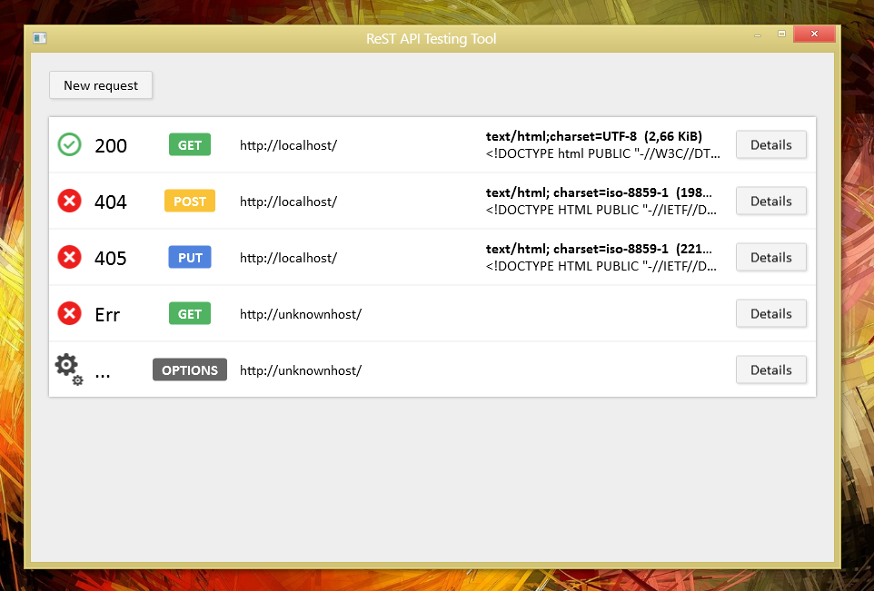

# ReST API Tester

This simple tool allows you to quickly specify a HTTP request and inspect the response from the server.

## Features

* Uses asynchronous programming (`async`/`await`)
* Respects MVVM pattern
* Well-documented code

## Screenshots

